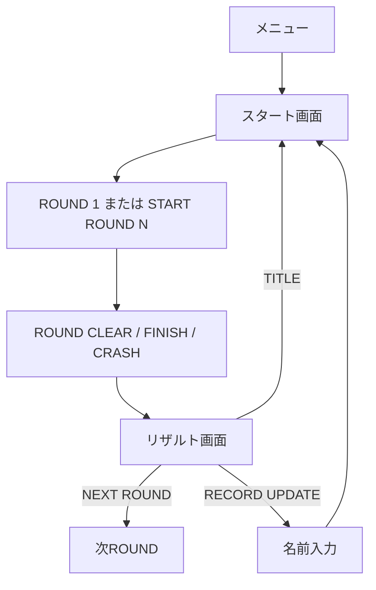

# ベクター・エアレース 仕様書

最終更新: 2026-04-25 JST

## 1. 概要

`ベクター・エアレース` は、宇宙トラック野郎と同等のスマホ画面幅・操作UIを前提にした、擬似3D飛行機レースゲームである。

描画は Canvas 2D によるワイヤーフレーム風表現とし、バリバリのポリゴン3Dではなく、線と半透明面で立体感を出す。
操作して気持ちよいことを最優先し、リアルな航空力学よりも、旋回、ロール、高度変化、速度変化の手触りを優先する。

## 2. 画面遷移

## 2.1 現行実装メモ 2026-04-25

- メインモードは `World Grand Prix` で、`ROUND 1-2` が導入、`ROUND 3-10` が本戦
- スタート画面はスクロール可能な HTML ページで、`PILOT NAME`、操作モード、機体選択、フィールド試験モード、開始ROUND選択を持つ
- リザルト画面もスクロール可能で、1位機体プレビュー、ラウンド順位、GP総合順位、名前入力を表示する
- 自機は 5 機から選択でき、色だけでなくシルエットも異なる
- ゴーストと CPU は混在可能で、同名エントリーは同一レースへ重複参加させない
- `FIELD TEST 8 / 12 / 16 / 24` により多機数テストが可能

## 3. スタート画面

スタート画面はスクロール可能な HTML ページで、次を表示する。

- タイトル
- パイロット名入力
- 操作モード選択
- 機体選択
- フィールドモード切り替え
- 開始ROUND切り替え
- `ROUND 1 START` と `ROUND N START`

ランキングはサーバ側 `airrace_scores.json` に保存する。
API は `/api/airrace/scores` を使う。

スコアは `ROUND` を優先し、同じ ROUND ならタイムが短いほど上位とする。
内部的には既存 `ScoreBoard` が「大きい score ほど上位」であるため、`ROUND` とタイムを整数 score に符号化して保存する。

## 4. 操作

### 4.1 スマホ

- 左下プニコン左右: 旋回
- 左下プニコン上: 機首下げ
- 左下プニコン下: 機首上げ
- 右下 BOOST: 加速

スマホでは、スタート画面で `プニコン` と `傾き操作` を選択できる。
傾き操作では DeviceOrientation を使用し、端末の左右傾きで旋回、前後傾きで機首上げ/下げを行う。

### 4.2 PC

- `A` / `←`: 左旋回
- `D` / `→`: 右旋回
- `W` / `↑`: 機首下げ
- `S` / `↓`: 機首上げ
- `Space`: BOOST

### 4.3 PS4/PS5 コントローラ

ブラウザの Gamepad API に対応する。
コントローラは接続後、ブラウザに認識させるために任意ボタンを1回押す必要がある。

- 左スティック左右: 旋回
- 左スティック上下: 機首下げ/機首上げ
- `×` / `R1`: BOOST全開
- `R2`: アナログBOOST。車のアクセルのように押し込み量で巡航速度から最高速度まで加速量を調整する
- `×`: START / NEXT ROUND / SAVE / TITLE などの決定
- `○` / `OPTIONS`: タイトルへ戻る

コントローラ接続中かつコントローラ操作モードでは、画面ボタンの左に `×` または `○` の操作ヒントを表示する。
UI操作は押しっぱなしではなく、ボタンを押した瞬間だけ反応する。

## 5. ROUND 仕様

現行は全10ROUND制とする。

| ROUND | 方針 |
|---:|---|
| 1 | 離陸訓練。自機のみ |
| 2 | 導入レース。緩い高低差と少数ライバル |
| 3 | USA 開幕戦 |
| 4 | France River Circuit |
| 5 | Italy Coastal Sprint |
| 6 | Netherlands Harbor Wind |
| 7 | Germany Rhine Industrial |
| 8 | China Megacity Ring |
| 9 | UAE Sky Dune Rush |
| 10 | Japan Grand Final |

ROUND 1 は現在の標準間隔の約3倍から開始し、ROUND が進むごとに間隔を短くする。

### 5.1 現在のコース方針

- ROUND 1-10 は `airrace_rounds.json` の固定レイアウトをラウンド開始時に取得する
- ROUND 1-2 は導入用で、広めのゲートと短めのレース長を優先する
- ROUND 3-10 は各国テーマに応じて背景色、遠景、地面表現、高度プロファイルを変える
- ROUND 9 UAE は市街地ビル群を持つ特設コース
- 全ラウンドとも最終ゲート通過後は着陸進入フェーズへ移る

### 5.2 ROUND 別の現在地

- ROUND 1:
  チュートリアル。ゲート数を抑え、追加パイロンは置かない。高度も安全寄りにする。
- ROUND 2:
  ROUND 1 の骨格を広げ、左右の振れと軽い高低差を追加する。追加パイロンは少量に留める。
- ROUND 3:
  高さ制限を活かすため、大きめの上下変化を持つ。左右の振れも ROUND 2 より増やす。
- ROUND 4:
  大きな左右振りと強い高低差を持つ。高速で流すよりも、攻めたライン取りを要求する。
- ROUND 5:
  最終面。ゲート数を増やし、Uターンや強い切り返しを含めた最難関構成とする。

## 6. クリア条件

各ROUNDは、すべてのゲートを順番に通過し、着陸条件を満たすと `ROUND CLEAR` または `FINISH` となる。

- ROUND 1-9 は `ROUND CLEAR`
- ROUND 10 は `FINISH`

リザルト画面では、ラウンド順位、獲得ポイント、GP総合順位を表示する。
記録更新時のみ名前入力欄を表示し、保存後にスタート画面へ戻る。

## 7. 失敗条件

次の場合は `CRASH` または `GAME OVER` としてスタート画面へ戻る。

- 地面に激突した
- DAMAGE が 100% になった

CRASH / GAME OVER ではランキング登録は行わない。
ただし ROUND2 以降で CRASH / GAME OVER した場合は、前 ROUND までの到達記録をランキング対象にする。

- ROUND1 で CRASH: 記録なし
- ROUND2 で CRASH: ROUND1 到達記録
- ROUND3 で CRASH: ROUND2 到達記録
- ROUND5 で CRASH: ROUND4 到達記録
- ROUND5 FINISH: ROUND5 完走記録

## 8. 誘導UI

画面上部に次ゲートへの誘導矢印を表示する。

- 大きな点滅矢印で方向を示す
- 下段に `GATE n / 距離m` を表示する
- `→` / `←` は左右旋回
- `↑` はおおむね前方
- `↻` / `↺` は後方に回り込んでいる状態

## 8.1 飛行計器UI

飛行中の計器は Canvas 内に描画する。
HTML の上部メーターはスマホ画面で表示領域を圧迫するため、ゲーム画面外には出さない。

- 上中央に大きい速度数字を表示する
- 下中央に速度メーターを表示する
- 右側に縦テープ式高度計を表示する
- 左上にラウンド国名つきミニマップを表示する
- ミニマップ下に参加者一覧を表示する
- 右上に `ROUND / TIME / DAMAGE / GP` を表示する
- `GATE CLEAR` などのメッセージは画面中央寄りのカットインとして短時間表示する
- 次ゲート誘導矢印はスタート説明中は出さず、飛行中のみ表示対象とする

## 9. 音

WebAudio で疑似サウンドを生成する。

- 通常飛行中: 小さなプロペラ音
- BOOST中: ブルブルした低音を追加
- ゲート通過: 高めの短音
- パイロン接触: 低めの衝突音
- 地面激突: クラッシュ音

FINISH / CRASH / GAME OVER 後はプロペラ音と BOOST 音を停止する。

BOOST 時の最高速度は 1500km/h とする。
PS4/PS5 コントローラの `R2` はアナログ入力として扱い、押し込み量に応じて目標速度を補間する。

## 9.1 景観・障害物

ゲート横だけでなく、コース周辺に追加パイロン、木、草を配置する。

- 追加パイロンは飛行空間の密度感を出すための障害物とする。
- 木と草は地上の速度感・高度感を出すための景観物とする。
- 景観物は現時点では衝突判定を持たない。

現在の実装では、ROUND 1 は追加パイロンなし、ROUND 2 は少量、ROUND 3 以降は通常量としている。

## 10. スマホ操作事故対策

ゲーム画面では次を抑制する。

- ダブルタップ拡大
- テキスト選択
- 長押しメニュー
- ブラウザのスクロール/オーバースクロール

### 10.1 PWA / 全画面起動

iPhone Safari の通常タブでは、URL欄やタブバーをWebページ側から完全には消せない。
そのため、PWA対応を行い、ホーム画面に追加して起動した場合に `standalone` 表示で遊べるようにする。

- `/airrace.webmanifest` を配信する。
- `display: standalone` を指定する。
- `orientation: any` とし、縦画面・横画面の両方を許可する。
- iOS向けに `apple-mobile-web-app-capable=yes` を指定する。
- `theme-color` と `apple-mobile-web-app-status-bar-style=black-translucent` を指定する。

## 11. 実装

現行実装は `app/src/airrace/` 配下へ分割している。

- `app/src/airrace/airrace.html`
- `app/src/airrace/airrace.css`
- `app/src/airrace/airrace.js`
- `app/src/airrace/js/config.js`
- `app/src/airrace/js/course.js`
- `app/src/airrace/js/game.js`
- `app/src/airrace/js/render.js`
- `app/src/airrace/airrace.webmanifest`
- `app/src/airrace/airrace_rounds.json`

ランキングは `airrace_scores.json` に保存する。
ゴーストは `airrace_ghosts.json` に保存する。
スコアAPIは `/api/airrace/scores`、ラウンドAPIは `/api/airrace/round/:round`、ゴーストAPIは `/api/airrace/ghosts` を使用する。
WebSocket は使用しない。

## 12. ゴースト飛行履歴

プレイヤーの飛行履歴は、サーバ側 `airrace_ghosts.json` に JSON として永続化する。
ブラウザの `localStorage` だけには依存しない。

### 12.1 保存タイミング

ROUND CLEAR または FINISH 時に、その ROUND の飛行サンプルを保存する。
また、一定サンプル数を満たしていればクラッシュ時も `DNF` ゴーストとして保存できる。

保存する飛行サンプルは約120ms間隔とし、1件の履歴につき最大1200サンプルまで保持する。
サーバ側では最新100プレイ分を保持し、古い履歴から削除する。

### 12.2 保存データ

1件の履歴は次の情報を持つ。

- `name`: プレイヤー名。未入力時は `PILOT`。
- `round`: 対象ROUND。
- `time_ms`: ROUND開始からの経過時間。
- `samples`: 飛行サンプル配列。
- `created_at`: 保存日時。

各サンプルは次を持つ。

- `t`: ROUND開始からの経過ミリ秒。
- `x`: 機体のワールドX座標。
- `y`: 機体のワールドY座標。
- `z`: 機体のワールドZ座標。
- `h`: 機首方向。
- `r`: ロール角。
- `s`: 速度。

### 12.3 再生仕様

ゲーム開始時に `/api/airrace/ghosts` からサーバ保存済み履歴を取得する。
現在ROUNDと同じ `round` の履歴が存在する場合、その中から1件を選び、ゴースト機として再生する。
該当履歴がない場合は従来のCPUライバルを表示する。

ゴーストはサンプル間を線形補間して移動する。
保存済みサンプルの終端に達した場合は、ゴール地点に貼り付かせず描画を終了する。

### 12.4 API

- `/api/airrace/ghosts` `GET`: 保存済みゴースト一覧を返す。`round` クエリ指定時は対象ROUNDのみ返す。
- `/api/airrace/ghosts` `POST`: 1件のゴースト履歴を保存する。

### 11.1 ルーティング

- `/airrace`: `app/src/airrace.html` を返す。
- `/airrace.webmanifest`: PWA manifest を返す。
- `/api/airrace/scores` `GET`: ランキング一覧と最低スコアを返す。
- `/api/airrace/scores` `POST`: 名前と符号化スコアを保存し、順位とランキング一覧を返す。

### 11.2 画面サイズ

宇宙トラック野郎と同じく、スマホ縦画面を主対象とする。
ただし、PWA全画面起動時の横画面プレイにも対応する。

- アプリ全体は `100dvh` を基準に中央寄せする。
- Canvas は表示サイズに合わせて内部描画サイズも更新する。
- Canvas の CSS 表示サイズだけを引き伸ばさず、描画バッファも `devicePixelRatio` を考慮して再設定する。
- これにより横画面でもスピードメーターなどの円形UIが楕円につぶれない。
- 画面が低い端末でも上寄せにせず、Canvas を最大限広く使う。
- iPhone のブラウザUIにプニコンや BOOST ボタンが被らないよう、操作UIは Canvas 内に収める。
- `resize` / `orientationchange` 時には Canvas サイズと描画基準点を再計算する。

### 11.3 現在のUI・描画補足

- カウントダウン中は ROUND 名、難易度 `★☆☆☆☆` 形式、短い説明文を Canvas 内に表示する。
- 地面グリッドは自機周辺の固定範囲ではなく、未通過ゲートの存在範囲まで自動で拡張して描画する。
- これにより、広いコースでも少なくともゲート周辺の地面グリッドは見えるようにする。

## 13. 更新履歴

| 日時 | 内容 |
|------|------|
| 2026-04-24 JST | ROUND 1-5 の固定コース化、ROUND別難易度調整、カウントダウン時のROUND説明表示、地面グリッド描画範囲の拡張 |
| 2026-04-22 17:41:07 JST | ゴースト飛行履歴のサーバ側JSON永続化、最大100件保持、ゴースト終端到達時の非表示仕様を追記 |
| 2026-04-22 11:32:00 JST | R2アナログBOOSTと最高速度1500km/h化を追記 |
| 2026-04-22 11:20:12 JST | PS4/PS5コントローラ対応、PWA全画面起動、横画面向け可変Canvas、ゲーム内MENU/メッセージオーバーレイ、ROUND表示位置調整を追記 |
| 2026-04-22 01:14:58 JST | 画面全体を `100dvh` 中央寄せに調整。方角メーター、誘導矢印、左上スピードメーター、右側高度テープの飛行計器UI仕様を追記 |
| 2026-04-22 00:25:00 JST | サーバ永続ランキング、ROUND途中クラッシュ記録、傾き操作、BOOST 1000km/h、追加パイロン/木/草を追記 |
| 2026-04-22 00:00:00 JST | 初版。スタート画面、5位ランキング、記録更新時名前入力、ROUND 1-5、誘導UI、音、スマホ操作対策を定義 |
