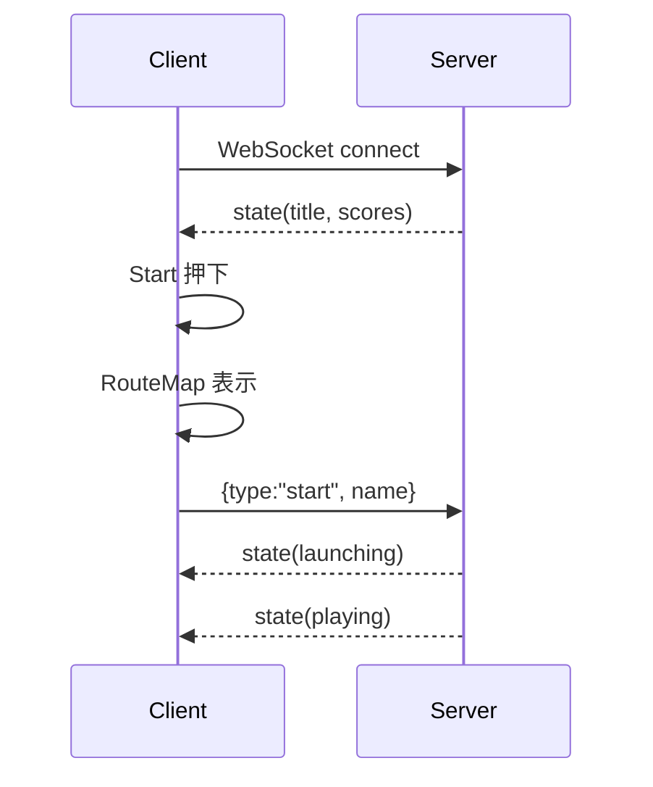
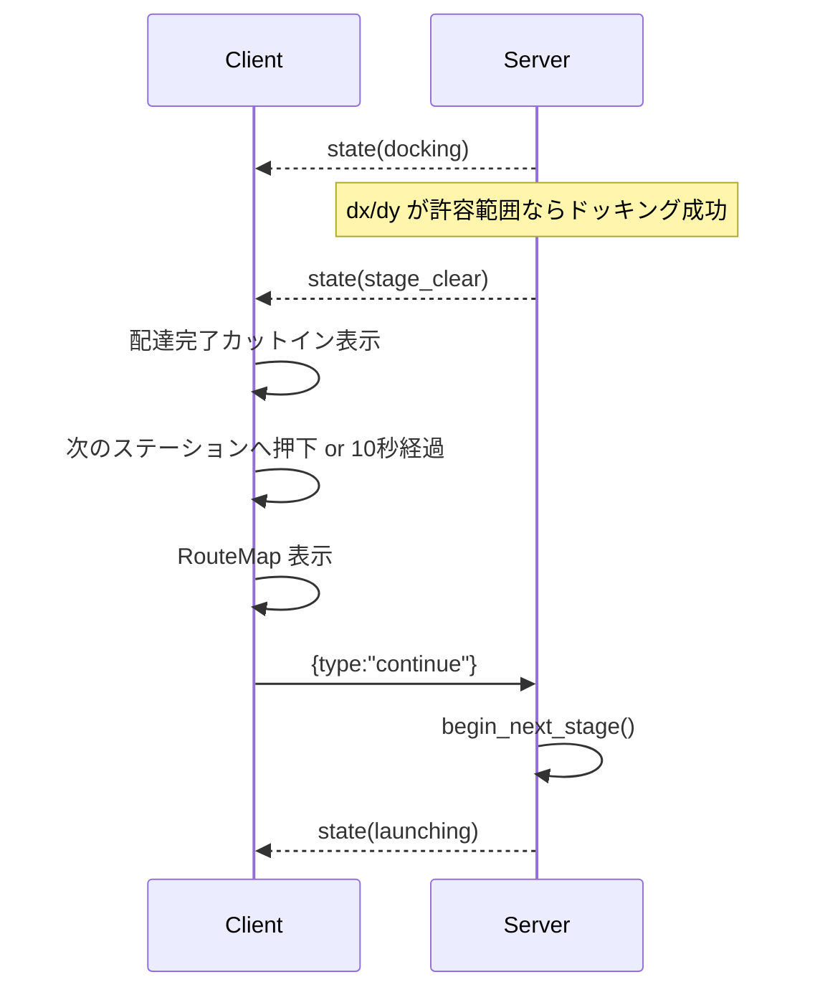
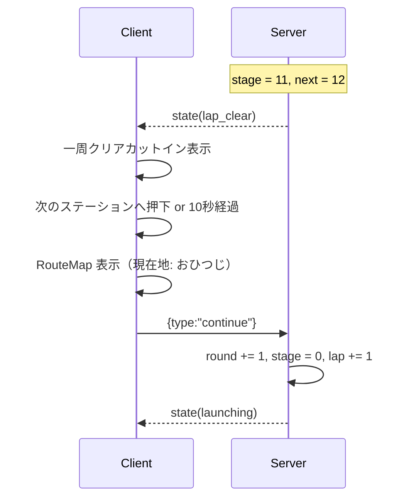
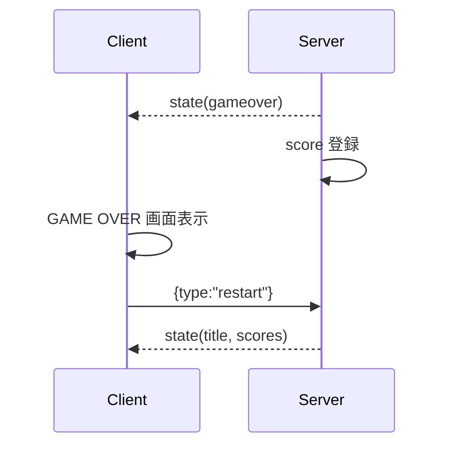

# 宇宙トラック野郎 仕様書

`ssnshino/rust-sandbox` で動く Rust 製の縦スクロール宇宙配送ゲームの仕様書。
本書は計画書ではなく、現在の実装が満たすべき画面・状態遷移・通信・ゲームルールの仕様を定義する。

作成: 2026-04-18  
最終更新: 2026-04-19 10:33 JST

---

## 1. 概要

`宇宙トラック野郎` は、火星と木星の間にあるアステロイドベルト地帯を舞台にした配送ゲームである。プレイヤーは中型宇宙トラックを操作し、12分割された円軌道上の宇宙ステーションを順番に巡回して荷物を届ける。

原作世界観は `projects/novels` の小説 `アステロイドベルトの片隅で` を参照する。主人公は宇宙トラック乗りのシノヤマ、GM は銀髪メガネっ娘のミサキとして扱う。

ゲームの主軸は次の4つである。

- 小惑星を避けて目的地へ向かう。
- 金鉱石・レアメタルをマニピュレーターで採取する。
- 目的地エアロックへ精密ドッキングする。
- 配達報酬・鉱石収入・修理費・燃料費・罰金を含む収支を見ながら周回する。

---

## 2. 画面仕様

### 2.1 論理画面サイズ

Canvas の論理サイズは `360 x 600` とする。スマホ表示では CSS により画面幅へ収めるが、ゲーム内座標系はこの論理サイズを基準にする。

```text
Canvas logical size: 360 x 600
W = 360
H = 600
```

HUD は Canvas の外側に配置する。ゲーム中の主な構成は次の通り。

```text
┌────────────────────────────┐
│ SCORE / DAMAGE / FUEL       │  game-hud（Canvas 外）
│ SPEED / ROUND / STATION     │
├────────────────────────────┤
│                            │
│        Canvas 360x600       │
│                            │
│  小惑星 / 鉱石 / 自機 /     │
│  ステーション / エアロック │
│                            │
├────────────────────────────┤
│ GMコメント（Canvas 直下左） │
├────────────────────────────┤
│ ぷにこん        MAG ボタン  │  touch-controls
└────────────────────────────┘
```

### 2.2 タイトル画面

タイトル画面では次を表示する。

- タイトル
- 名前入力
- スタートボタン
- ランキング上位5件
- 操作説明
- 言語切替
- メニューへ戻るボタン

タイトル画面では、ぷにこんと `MAG` ボタンは表示しない。

### 2.3 航路マップ画面

ゲーム開始前および各ステージ開始前に、12星座宇宙ステーションを円軌道上に表示する。

- 12ステーションはアステロイドベルト上の円軌道を12分割した位置に配置する。
- 第1宇宙ステーションは `おひつじ` とする。
- 現在地を明示する。
- 次の目的地は緑の点滅丸で示す。
- 目的地カードは他ステーションより前面レイヤに出す。
- `出発！` ボタンで即開始する。
- 操作しない場合は 10 秒で自動的に開始する。

表示文言は次の形式を基本とする。

```text
現在地は第1宇宙ステーション おひつじ。次の目的地は第2宇宙ステーション おうしだ！
```

英語表示では `Station 1 Aries` のように表示する。

### 2.4 ゲーム画面

ゲーム中は次を表示する。

- SCORE
- DAMAGE
- FUEL
- SPEED
- ROUND
- 現在ステージ番号 `/12`
- Canvas
- GM コメント
- ぷにこん
- `MAG` ボタン

`LAP` は内部状態として保持してよいが、HUD には表示しない。周回の表示は `ROUND` に一本化する。

### 2.5 配達完了画面

目的地へドッキングすると配達完了画面を表示する。通常クリアと一周クリアで表示文言は分岐する。

配達完了画面では次を表示する。

- 配達完了タイトル
- ミサキの顔カットインと台詞
- シノヤマの顔カットインと台詞
- スコア内訳
- `次のステーションへ！` ボタン

ボタンを押すか、10秒経過すると航路マップ画面へ進む。サーバへの `continue` は航路マップの `出発！` 後にのみ送信する。

### 2.6 GAME OVER 画面

耐久が 0% になると GAME OVER 画面へ遷移する。

- スコアをランキングへ登録する。
- ランキング上位5件を表示する。
- `Try Again` は航路マップを挟まず、タイトル画面へ戻す。

---

## 3. ステーション仕様

ステーションは全12個で、順番は固定する。

| 番号 | 日本語 | 英語 | 記号 |
|---:|---|---|---|
| 1 | おひつじ | Aries | ♈ |
| 2 | おうし | Taurus | ♉ |
| 3 | ふたご | Gemini | ♊ |
| 4 | かに | Cancer | ♋ |
| 5 | しし | Leo | ♌ |
| 6 | おとめ | Virgo | ♍ |
| 7 | てんびん | Libra | ♎ |
| 8 | さそり | Scorpio | ♏ |
| 9 | いて | Sagittarius | ♐ |
| 10 | やぎ | Capricorn | ♑ |
| 11 | みずがめ | Aquarius | ♒ |
| 12 | うお | Pisces | ♓ |

通常開始時は第1宇宙ステーション `おひつじ` から始まり、第2宇宙ステーション `おうし` へ向かう。

第12宇宙ステーション `うお` から第1宇宙ステーション `おひつじ` へ到着した場合は `LapClear` とする。次の開始は `ROUND + 1`、第1宇宙ステーション `おひつじ` から第2宇宙ステーション `おうし` へ向かう。

---

## 4. 状態遷移仕様

### 4.1 フェーズ一覧

| フェーズ | 意味 | 主な遷移先 |
|---|---|---|
| `Title` | 開始待ち | 航路マップ経由で `Launching` |
| `Launching` | 発進演出 | `Playing` |
| `Playing` | 通常航行 | `BoosterDocking` / `Docking` / `GameOver` |
| `BoosterDocking` | 中継ブースター接続 | `Playing` / `Docking` |
| `Docking` | 目的地ドッキング | `StageClear` / `LapClear` |
| `StageClear` | 通常ステージ完了 | 航路マップ経由で `Launching` |
| `LapClear` | 12ステーション一周完了 | 航路マップ経由で `Launching` |
| `GameOver` | ゲーム終了 | `Title` |

### 4.2 通常開始シーケンス



### 4.3 通常クリアシーケンス



### 4.4 一周クリアシーケンス



### 4.5 GAME OVER シーケンス



---

## 5. 操作仕様

### 5.1 キーボード

| 操作 | 内容 |
|---|---|
| ↑ | メインエンジン噴射、上方向へ加速 |
| ↓ | リトロスラスター、下方向へ加速 |
| ← | 右サイドスラスター、左方向へ加速 |
| → | 左サイドスラスター、右方向へ加速 |
| Space / MAG | マニピュレーターを伸ばす |

### 5.2 スマホ

| UI | 内容 |
|---|---|
| ぷにこん | 上下左右スラスター入力 |
| MAG | マニピュレーター操作 |

スラスターを離した後も慣性で少し流れる。

---

## 6. 航行・スクロール仕様

### 6.1 慣性

自機には速度ベクトルがあり、入力で加速し、ドラッグで徐々に減衰する。完全な停止ではなく、宇宙空間らしく少し流れる感覚を重視する。

### 6.2 スクロール速度

画面上部へ行くほど背景スクロール速度が上がる。下側へ戻ると遅くなる。

速度表示は `SPEED xx km/h` とする。

- 上方向巡航の目安: 60 km/h
- 上方向最大の目安: 120 km/h
- 下方向移動の目安: 最大 30 km/h

### 6.3 ブースター高速スクロール

ブースター装着後は `fast_scroll = true` となり、背景、小惑星、鉱石の流れが速くなる。ブースター装着中は赤い二連スラスターを表示し、炎の長さも通常より長くする。

---

## 7. 耐久・燃料・お金

### 7.1 耐久

耐久は `100%` を無傷、`0%` をゲームオーバーとする。HUD では `DAMAGE` として表示する。

小惑星衝突時のダメージはサイズで変化する。

| 小惑星サイズ | ダメージ目安 |
|---|---:|
| 最小 | 5% |
| 小 | 8% |
| 中 | 12% |
| 大 | 16% |
| 最大 | 20% |

### 7.2 燃料

燃料は `100.00%` から始まり、スラスター使用で減る。HUD では `FUEL` として `XX.XX%` 表示する。

現在の消費量は次を基準にする。

| 入力 | 消費 |
|---|---:|
| メインエンジン | 0.5% |
| 左右スラスター | 0.1% |
| 下スラスター | 0.1% |

### 7.3 補給・修理

ステーション到着時、所持金から自動的に修理と燃料補給を行う。

- 耐久減少分に応じて修理費が発生する。
- 燃料減少分に応じて燃料補給費が発生する。
- 所持金が不足している場合は支払える範囲だけ回復する。

### 7.4 お金

所持金は鉱石採取で増える。

| 鉱石 | 金額 |
|---|---:|
| 金鉱石 | 500$ |
| レアメタル | 100$ |

所持金はスコアとは別に管理する。

---

## 8. 鉱石・マニピュレーター仕様

鉱石は小さい小惑星と同程度のサイズで画面上から流れてくる。

- 金鉱石
- レアメタル

鉱石は自機と重なっただけでは取得できない。取得には `MAG` ボタンでマニピュレーターを伸ばし、先端を鉱石に接触させる必要がある。

取得時はスコアと所持金の両方に反映する。取得音は `ピコン` 系の軽い音とする。

---

## 9. ドッキング仕様

### 9.1 通常ドッキング

目的地のエアロックは終盤に表示される。自機中心座標とエアロック座標の差を使い、次の許容値で判定する。

```text
dx = abs(ship.x - airlock_x)
dy = abs(ship.y - AIRLOCK_Y)
ドッキング成功: dy < DOCK_Y_R && dx < DOCK_X_OK
```

横方向の精度でボーナスが変化する。

| 精度 | 条件 | ボーナス |
|---|---|---:|
| Perfect | `dx < DOCK_X_PERFECT` | 高 |
| Good | `dx < DOCK_X_GOOD` | 中 |
| OK | `dx < DOCK_X_OK` | 低 |

### 9.2 時間超過

`Docking` フェーズで進行率が 100% を超えた場合、遅延罰金として `-200$` を適用する。罰金は一度だけ発生する。

### 9.3 一周クリア

第12宇宙ステーションから第1宇宙ステーションへのドッキング成功は `LapClear` である。`LapClear` は通常の `StageClear` と異なり、周回ボーナスを加算し、次回開始時に `round` と `lap` を進める。

---

## 10. ブースター便仕様

ブースター便は毎回ではなく、3ステージに1回発生する。

1. ひとつ前の配達完了画面で、次便が急ぎ便であることを予告する。
2. 次ステージ開始後、序盤で中継ブースターが出現する。
3. ブースターへドッキングできると `booster_attached = true` となる。
4. 以後、そのステージは高速スクロールになる。

ブースター装着には `1000$` が必要である。所持金が足りない場合、ブースターは装着できず通常航行へ戻る。

---

## 11. スコア仕様

配達完了時のスコア内訳は次の通り。

| 項目 | 内容 |
|---|---|
| 配達報酬 | ステージ到着の基本点 |
| エアロック命中 | ドッキング精度ボーナス |
| 鉱石ボーナス | 金鉱石・レアメタルの採取数によるスコア |
| 耐久ボーナス | 一周クリア時の耐久残量ボーナス |
| 遅延罰金 | 時間超過時の減点 |
| 修理代 | 所持金の支出として表示 |
| 燃料補給 | 所持金の支出として表示 |
| 合計スコア | スコアランキングに使う値 |

修理代と燃料費は所持金の支出であり、スコア計算とは表示上分ける。

---

## 12. イベント一覧

サーバは `event` キーで一時イベントを送る。クライアントは GM コメント、効果音、演出に使う。

| event | 意味 | 表示・音 |
|---|---|---|
| `damage` | 小惑星衝突 | GM警告、被弾音 |
| `delivery` | 通常配達完了 | クリア画面 |
| `lap_clear` | 一周完了 | 一周クリア画面 |
| `booster_call` | ブースター中継出現 | GM案内 |
| `booster_attach` | ブースター装着成功 | 高速スクロール化 |
| `booster_fee_short` | ブースター代不足 | GM警告 |
| `late_fine` | 遅延罰金発生 | GM警告 |
| `mineral_gold` | 金鉱石取得 | ピコン音、GMコメント |
| `mineral_rare` | レアメタル取得 | 高めのピコン音、GMコメント |
| `gameover` | ゲームオーバー | GAME OVER 画面 |

---

## 13. WebSocket メッセージ仕様

### 13.1 Client -> Server

```json
{ "type": "start", "name": "シノヤマ" }
```

```json
{ "type": "input", "keys": { "up": true, "down": false, "left": false, "right": false, "manip": false } }
```

```json
{ "type": "continue" }
```

```json
{ "type": "restart" }
```

### 13.2 Server -> Client

サーバは `state` を返す。

主なキーは次の通り。

| キー | 内容 |
|---|---|
| `phase` | 現在フェーズ |
| `ship` | 自機座標、速度、無敵状態 |
| `hp` | 耐久% |
| `fuel` | 燃料% |
| `score` | スコア |
| `money` | 所持金 |
| `round` | 周回番号 |
| `stage` | 0-based ステージ番号 |
| `lap` | 内部周回カウンタ |
| `from` | 出発ステーション |
| `to` | 目的地ステーション |
| `asteroids` | 小惑星配列 |
| `minerals` | 鉱石配列 |
| `event` | 一時イベント |
| `booster_enabled` | ブースター便か |
| `booster_attached` | ブースター装着済みか |
| `fast_scroll` | 高速スクロール中か |

---

## 14. フロントエンド構成

```text
app/src/truckers/
├── mod.rs                 # Rust 側ゲームロジック / WS
├── truckers.html          # DOM 構造
├── truckers.css           # スタイル
├── truckers.js            # module entrypoint
├── truckers.i18n.json     # 日本語/英語文言
├── js/
│   ├── main.js            # 初期化
│   ├── state.js           # 共有状態と DOM refs
│   ├── i18n.js            # 文言ロード・切替
│   ├── ui.js              # DOM UI と状態遷移画面
│   ├── render.js          # Canvas 描画
│   ├── audio.js           # Web Audio 効果音
│   ├── input.js           # キー/タッチ入力
│   └── ws.js              # WebSocket 受信処理
├── truckers_man.jpg       # シノヤマ顔
└── truckers_girl.jpg      # ミサキ顔
```

UI は素の DOM 操作で実装する。Vue は使わない。理由は、Vue 化時に初期化・描画・ボタンイベントの不安定化が発生したためである。現在は JS module 分割のみ維持する。

---

## 15. 多言語仕様

文言は `truckers.i18n.json` に集約する。

- `ja`
- `en`

クライアントは `/truckers.i18n.json` を fetch し、`t()` と `tf()` で文言を解決する。直接 `i18n[lang]` のように参照しない。これは `lap_clear` 表示で実際に不具合を起こしたため、仕様として禁止する。

---

## 16. 既知の設計判断

- `round` と `lap` は内部的には両方保持するが、HUD 表示は `ROUND` のみにする。
- `lap` は将来の統計や内部管理用として残す。
- route map は開始前に出す。ゲーム tick を裏で進めながら表示してはいけない。
- `StageClear` / `LapClear` から次へ進む時は、必ず route map を挟んでから `continue` を送る。
- `GameOver` の `Try Again` は route map を挟まず、タイトルへ戻る。
