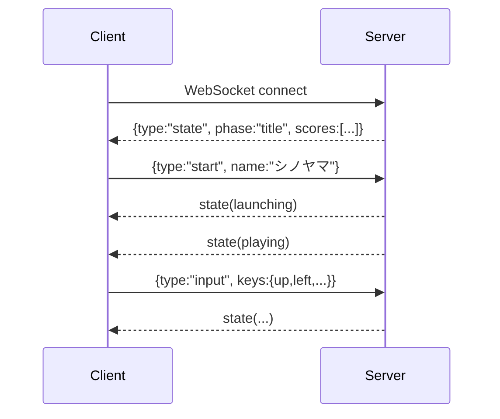
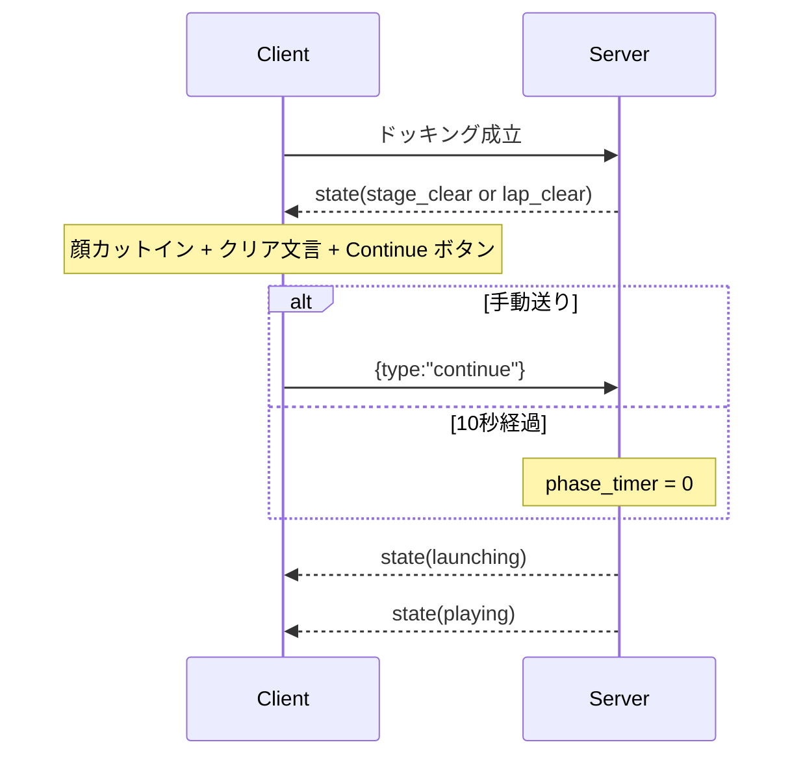
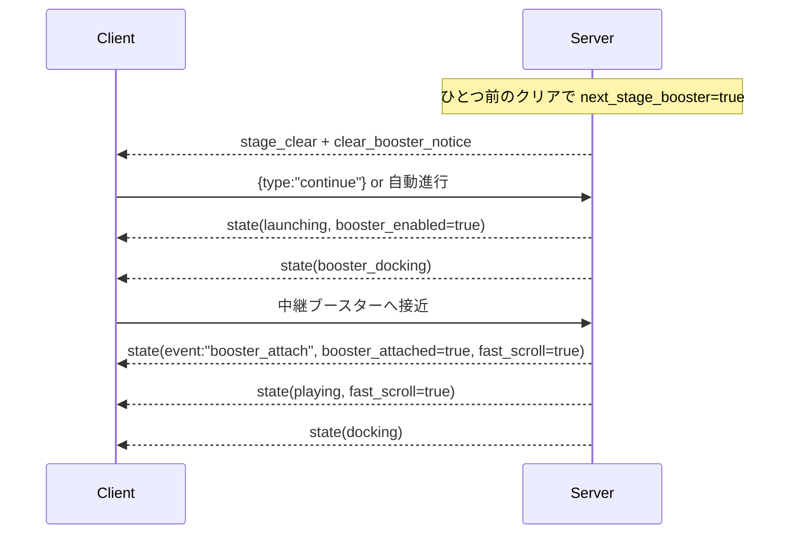

# 宇宙トラック野郎 仕様書

`ssnshino/rust-sandbox` で動く Rust 製縦スクロール配送ゲームの仕様まとめ。

作成: 2026-04-18  
最終更新: 2026-04-18

---

## 目次

1. [概要](#概要)
2. [システム構成図](#システム構成図)
3. [ゲーム全体フロー](#ゲーム全体フロー)
4. [ステージ進行フロー](#ステージ進行フロー)
5. [WebSocket メッセージシーケンス](#websocket-メッセージシーケンス)
6. [ゲームロジック](#ゲームロジック)
7. [スコア仕様](#スコア仕様)
8. [イベントステージ仕様](#イベントステージ仕様)
9. [フロントエンド](#フロントエンド)
10. [サウンド](#サウンド)
11. [設計メモ・既知の挙動](#設計メモ既知の挙動)
12. [今後の拡張メモ](#今後の拡張メモ)

---

## 概要

- 上方向へ進む宇宙トラックを操作し、宇宙ステーションへ荷物を届ける縦スクロール配送ゲーム
- 小惑星回避、鉱石採取、精密ドッキング、イベントステージを組み合わせたスコアアタック型
- 主人公は原作小説 `アステロイドベルトの片隅で` の宇宙トラック乗り `シノヤマ`
- GM として銀髪メガネっ娘が状況を軽快に案内する
- WebSocket でサーバー側ゲーム状態を同期し、クライアントは Canvas 描画と入力を担当する

---

## システム構成図

```text
┌─────────────────────────────────────────────────────────────────┐
│ Browser                                                         │
│                                                                 │
│  truckers.html                                                  │
│  ┌──────────────┐   WS メッセージ   ┌───────────────────────┐   │
│  │ JS Render    │ ←──────────────→ │ axum WebSocket run()  │   │
│  │ / Input      │                  │ tokio::select!        │   │
│  │ Canvas 540²  │                  │ Game tick (33ms)      │   │
│  └──────────────┘                  └───────────┬───────────┘   │
│                                                │               │
└────────────────────────────────────────────────│───────────────┘
                                                 │
                         ┌───────────────────────┼──────────────────────┐
                         │ axum Server           ▼                      │
                         │                                              │
                         │ GET /truckers            → truckers.html      │
                         │ GET /truckers/refs/:name → 顔画像 JPEG        │
                         │ GET /ws/truckers         → truckers::run()    │
                         │                                              │
                         │ truckers.rs   ←→ scores.rs                   │
                         │ main.rs       ←→ truckers.html               │
                         │                                              │
                         │ truckers_scores.json （永続）                │
                         └──────────────────────────────────────────────┘
```

### ファイル構成

```text
app/src/
├── main.rs               # ルーティング全体。truckers の画像配信ルートも持つ
├── truckers.rs           # ゲームロジック・WebSocket ハンドラ
├── scores.rs             # ハイスコア管理（共通）
├── truckers.html         # 描画・入力・UI・音
├── truckers_man.jpg      # クリアカットイン用 主人公顔
└── truckers_girl.jpg     # クリアカットイン用 GM 顔
```

### セッションモデル

- 接続 1 本につき独立した `Game` インスタンス
- サーバーが 33ms ごとに `tick_game()` を進めて `state` を送信
- クライアント入力は `ClientMsg::Input` で逐次反映
- ハイスコアだけ `ScoreBoard` を共有

---

## ゲーム全体フロー

```text
[Title]
  │ Start(name)
  ▼
[Launching]
  │ 発射演出で下側エアロックから上昇
  ▼
[Playing]
  │ 小惑星回避・鉱石採取
  ├── 条件により [BoosterDocking]
  └── 終盤で [Docking]
       ▼
[StageClear / LapClear]
  │ 顔カットイン + クリア文言
  │ 10秒待機 or Continue ボタン
  ▼
[次ステージ Launching]

HP=0
  ▼
[GameOver]
  │ スコア登録
  ▼
[Title]
```

---

## ステージ進行フロー

### 通常便

1. ステーションから打ち上げ
2. 小惑星を避けながら上昇
3. 必要に応じて鉱石を採取
4. 終盤で目的地エアロックが出現
5. ドッキング成功でステージクリア

### ブースター便

- 毎ステージではなく、**3ステージに1回** 次ステージで発生
- ひとつ前の `StageClear` カットインで次便がブースター便であることを予告
- 次ステージでは発進直後に中継ブースターへ接続
- 接続成功後だけ高速スクロール化

### ラップ

- 全 12 ステーションを回ると `LapClear`
- ライフボーナスを加算
- `round` を上げて最初のステーションへ戻る

---

## WebSocket メッセージシーケンス

### 通常開始



### クリアから次ステージ



### ブースター便



---

## ゲームロジック

### フェーズ

- `Launching`
  - 発進演出
  - 自動上昇して `LAUNCH_TARGET_Y` 付近で巡航開始
- `Playing`
  - 通常プレイ
- `BoosterDocking`
  - 対象ステージのみ発生
  - 中継ブースターへの接続判定
- `Docking`
  - 目的地エアロックへの最終進入
- `StageClear`
  - ステージクリア演出
- `LapClear`
  - 1 周クリア演出
- `GameOver`
  - ランキング登録後、再スタート待ち

### 自機

- 上向き固定
- 慣性移動あり
- スラスター入力がない時も慣性で少し流れる
- ライフは `SHIP_HP = 3`

### 小惑星

- 速度 5 段階
- サイズ 5 段階
- ラウンド進行で速度補正
- 画面外へ抜けたら削除または左右ラップ

### 鉱石

- `Gold`
- `Rare`
- `MAG` で伸びるマニピュレーター先端に触れたら取得

### ブースター

- `booster_enabled=true` のステージだけ発生
- 発進直後 (`BOOSTER_TRIGGER_PCT = 0.14`) に中継ブースター phase へ
- 接続成功で
  - `booster_attached=true`
  - `fast_scroll=true`
  - 自機にブースターポッド表示

### 高速スクロール

- ブースター接続後のみ有効
- 背景スクロール速度の上下限を引き上げ
- 小惑星 / 鉱石の落下速度も加速
- 小惑星出現間隔もやや短縮

---

## スコア仕様

- 基本配送成功
  - `SCORE_DELIVERY * round`
- ドッキング精度
  - `perfect / good / ok`
- ブースター接続精度
  - `perfect / good / ok`
- 金鉱石 / レアメタル取得
- ラップクリア時の残ライフボーナス

---

## イベントステージ仕様

### 実装済み

- 中継ブースタードッキング
- ブースター接続後の高速スクロール

### 予定

- 流星群
- 宇宙珍走団
- 暴走宇宙軽トラ
- 反射デブリ / 跳ね返り小惑星

---

## フロントエンド

### 描画

- `truckers.html` の Canvas 540x540
- 背景は星層 + 星雲
- ステーション、トラック、小惑星、鉱石、マニピュレーターを手描き

### UI

- タイトル
  - 名前入力
  - Start
  - 日英切替
  - ランキング上位5件
- プレイ中
  - 外部 HUD (`SCORE / LIFE / ROUND`)
  - GM コメント
- クリア
  - 顔カットイン
  - 10秒自動進行
  - `次のステーションへ！` ボタン

### 言語

- `ja` / `en`
- `localStorage(gc_lang)` に保存

### 名前保存

- `truckers_player_name` を `localStorage` に保存

---

## サウンド

- Web Audio API ベース
- メインエンジン連続音
- サイドスラスター `ぷしっ`
- 鉱石取得 `ピコン`
- GM 進行に合わせた軽い効果音拡張余地あり

---

## 設計メモ・既知の挙動

- クリアカットインの顔画像は `main.rs` から `/truckers/refs/:name` として配信
- 画像実体は `app/src/truckers_man.jpg`, `app/src/truckers_girl.jpg`
- クリア時は `phase_timer = 300`（約 10 秒）
- `ClientMsg::Continue` で即時次ステージへ進める

---

## 今後の拡張メモ

- イベントごとの専用 BGM / 効果音
- 原作小説寄りの台詞分岐
- ブースター便専用の背景演出
- 宇宙珍走団 / 軽トラなどの別カテゴリ障害物

