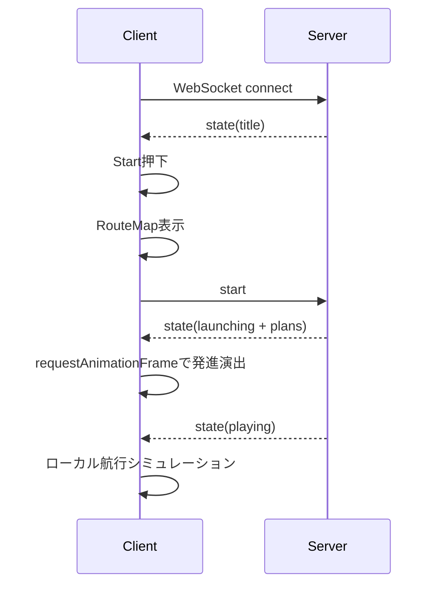
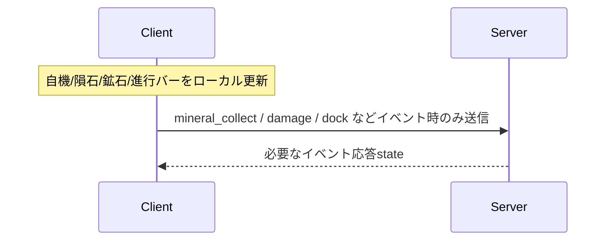
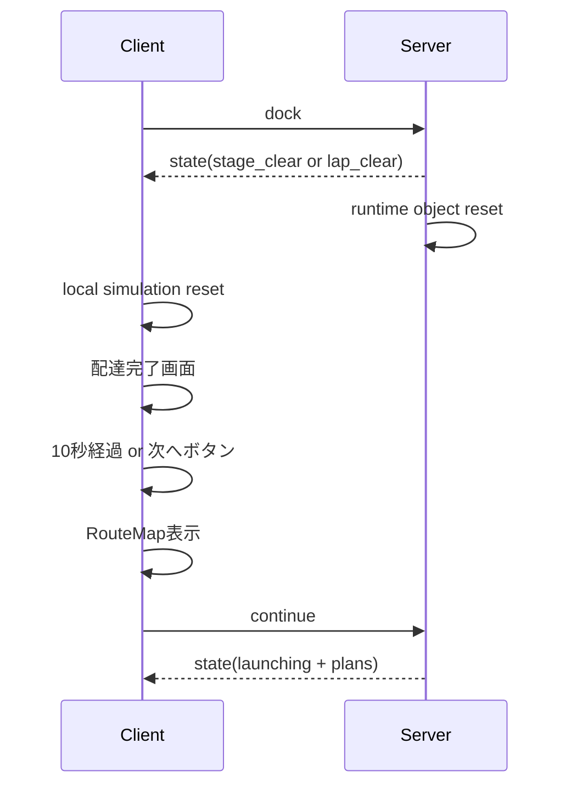
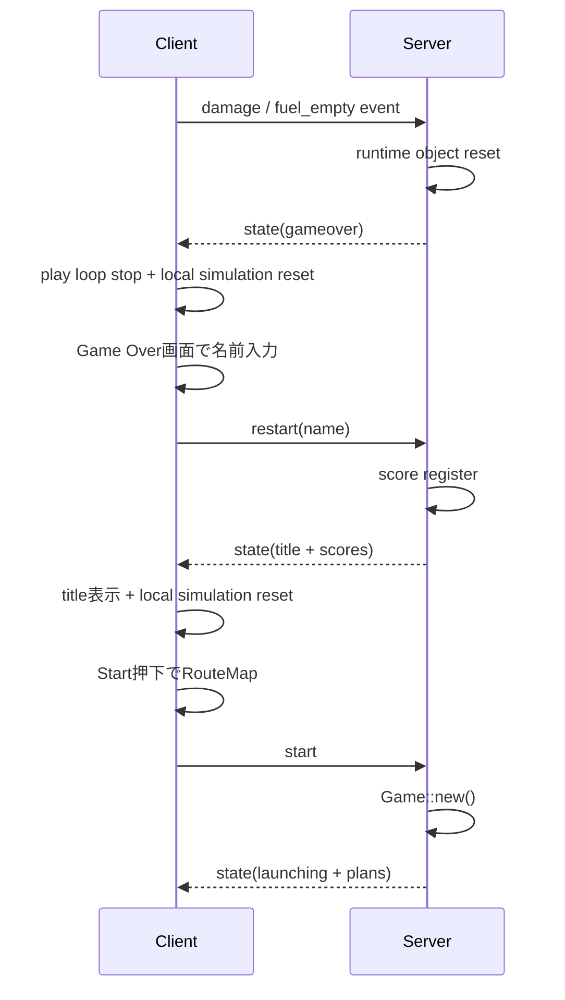

# 宇宙トラック野郎 仕様書 v2

作成: 2026-04-21 15:19:32 JST  
対象: `rust-sandbox` / `app/src/truckers/`

## 1. 目的

本書は、宇宙トラック野郎の現行 v2 実装が満たすべき仕様を定義する。
計画書ではなく、画面、状態遷移、通信、ゲームルール、コード責務の基準を固定するための仕様書である。

v2 の主な方針は次の通り。

- ブラウザが自機、隕石、鉱石のフレーム単位シミュレーションを担当する。
- Rust サーバはゲーム進行の権威状態、スコア、クリア判定、ステージ開始データ配布を担当する。
- WebSocket は常時 30fps 送信しない。
- 通信はステージ開始、フェーズ変更、ゲームイベント、ゲームオーバーなどの意味のあるタイミングに限定する。
- Canvas 描画は WebSocket 受信頻度に依存せず、`requestAnimationFrame` で進める。

## 2. 画面仕様

### 2.1 Canvas と HUD

Canvas 論理サイズは `360 x 600` とする。

```text
W = 360
H = 600
```

HUD は Canvas 外に置く。

表示項目は次の通り。

- `SCORE`
- `DAMAGE`
- `FUEL`
- `SPEED`
- `ROUND`
- ステージ番号 `n/12`
- 金鉱石数
- レアメタル数

`LAP` は内部状態として保持してよいが、HUD には表示しない。

### 2.2 タイトル画面

タイトル画面は次を表示する。

- タイトル
- スタートボタン
- ランキング上位5件
- 日本語/英語切替
- トップへ戻るリンク

タイトル画面では、ぷにこん、`MAG` ボタン、名前入力欄を表示しない。
プレイヤー名はゲーム開始時には要求せず、ハイスコア登録が必要になる Game Over 画面で入力する。

### 2.3 航路マップ画面

ゲーム開始前と各ステージ開始前に、12星座宇宙ステーションを円軌道表示する。

- 航路マップは、太陽を中心とした簡易太陽系の上面図として扱う。
- アステロイドベルト軌道に加えて、地球軌道と火星軌道を薄い円で表示する。
- 現在年月日をブラウザの `Date` から取得し、J2000.0 からの経過日数と平均公転周期で地球・火星の概算位置を表示する。
- 地球は青い点、火星は赤い点で表示する。
- 地球・火星が黄道12星座のどの付近にいるかをラベル表示する。
- この天体位置は演出用の近似であり、天文暦レベルの精度は保証しない。
- 現在地を示す。
- 次の目的地を緑の点滅丸で示す。
- 目的地カードは前面レイヤに出す。
- `出発！` ボタンで即開始する。
- 操作しない場合は 10 秒で自動開始する。
- WebSocket 再接続で `title` state が届いても、航路マップ表示中はタイトルへ戻さない。

### 2.4 ゲーム画面

ゲーム中は Canvas 内に次を表示する。

- 宇宙背景
- 自機
- 小惑星
- 金鉱石
- レアメタル
- マニピュレーター
- ブースター中継ステーション
- 燃料補給ステーション
- 目的地宇宙ステーション
- 右側進行バー

Canvas 下には GM コメントを表示する。

### 2.5 配達完了画面

目的地ドッキング成功時に配達完了画面を表示する。

- 配達完了タイトル
- ミサキの顔カットインと台詞
- シノヤマの顔カットインと台詞
- スコア内訳
- `次のステーションへ！` ボタン

10秒経過、またはボタン押下で航路マップへ進む。
サーバへ `continue` を送るのは、航路マップの `出発！` 後だけとする。

WebSocket 再接続で `title` state が届いても、配達完了画面表示中はタイトルへ戻さない。

### 2.6 Game Over 画面

耐久 `DAMAGE` が 0% になる、または FUEL が 0% になると Game Over とする。

- 名前入力欄を表示する。
- `Try Again` 押下時に、入力された名前でスコアをランキング登録する。
- 名前が空の場合は既定名でランキング登録する。
- ランキング上位5件を表示する。
- `Try Again` は航路マップを挟まずタイトル画面へ戻る。

Game Over に入った時点で、JS 側はローカル物理状態、岩石 plan、鉱石 plan、航路設定 cache、描画 loop を破棄する。
Rust 側も GameOver state 送信前に、岩石、鉱石、マニピュレーター、無敵時間などステージ中だけ有効な runtime object を破棄する。
タイトル画面へ戻ったあとは、次回スタート時に必ず新しい `Game::new()` と新しい JS ローカル状態から開始する。

### 2.7 シーン境界リセット

シーンをまたぐときは、前シーンの移動体やタイマーが次シーンに残らないように、JS と Rust の両方でリセットを行う。

| 境界 | JS 側 | Rust 側 |
|---|---|---|
| タイトル表示 | 描画 loop 停止、ローカル状態破棄、plan cache 破棄 | セッション待機状態。次の `start` で新規 `Game` を作成 |
| ゲーム開始前航路マップ | ローカル状態と plan cache を破棄してから航路マップを表示 | まだ gameplay state は進めない |
| 航路マップ `出発！` | `start` または `continue` だけ送信 | `start` は新規ゲーム、`continue` は `begin_next_stage()` |
| ステージクリア | 描画 loop 停止、ローカル状態破棄、plan cache 破棄 | スコア計算後に runtime object を破棄し、StageClear/LapClear を返す |
| Game Over | 描画 loop 停止、ローカル状態破棄、plan cache 破棄 | runtime object を破棄し、GameOver state を返す |

runtime object には、岩石、鉱石、マニピュレーター長、無敵時間、ブラウザ側のローカル ship 状態、ローカル tick、取得済み鉱石 ID を含む。

## 3. ステーション仕様

12ステーションは固定順で巡回する。

| 番号 | 日本語 | 英語 | 記号 |
|---:|---|---|---|
| 1 | おひつじ | Aries | ♈ |
| 2 | おうし | Taurus | ♉ |
| 3 | ふたご | Gemini | ♊ |
| 4 | かに | Cancer | ♋ |
| 5 | しし | Leo | ♌ |
| 6 | おとめ | Virgo | ♍ |
| 7 | てんびん | Libra | ♎ |
| 8 | さそり | Scorpio | ♏ |
| 9 | いて | Sagittarius | ♐ |
| 10 | やぎ | Capricorn | ♑ |
| 11 | みずがめ | Aquarius | ♒ |
| 12 | うお | Pisces | ♓ |

第12宇宙ステーション `うお` から第1宇宙ステーション `おひつじ` へ到着すると `LapClear` とする。
その後は `ROUND + 1` とし、第1から第2へ向かう。

## 4. フェーズ仕様

| フェーズ | 役割 | 次の主な状態 |
|---|---|---|
| `Title` | 開始待ち | `Launching` |
| `Launching` | 発進演出 | `Playing` |
| `Playing` | 通常航行 | `BoosterDocking` / `FuelDocking` / `Docking` / `GameOver` |
| `BoosterDocking` | ブースター接続 | `Playing` / `Docking` |
| `FuelDocking` | 燃料補給 | `Playing` / `Docking` |
| `Docking` | 目的地ドッキング | `StageClear` / `LapClear` |
| `StageClear` | 通常配達完了 | 航路マップ経由で `Launching` |
| `LapClear` | 一周配達完了 | 航路マップ経由で `Launching` |
| `GameOver` | 終了 | `Title` |

## 5. 通信仕様

### 5.1 WebSocket 方針

v2 では、WebSocket をフレーム同期に使わない。

サーバから送る主な state は次の通り。

- 接続直後の `title`
- ステージ開始直後の `launching`
- `launching -> playing` などのフェーズ変更
- `booster_docking`
- `fuel_docking`
- `docking`
- `stage_clear`
- `lap_clear`
- `gameover`
- 鉱石取得、補給、ブースター接続などのイベント応答

通常航行中に、意味のない定期 state は送らない。

### 5.2 ステージ開始データ

ステージ開始直後に、サーバは次を渡す。

- `asteroid_plan`: 小惑星の出現予定
- `mineral_plan`: 鉱石の出現予定
- `route_config`: ドッキング許容値、補給/ブースター座標基準

ブラウザはこれらをキャッシュし、以降のフレーム単位移動はローカルで行う。

### 5.3 クライアントイベント

ブラウザは意味のあるイベントだけをサーバへ送る。

- `damage`
- `fuel_empty`
- `mineral_collect`
- `booster_dock`
- `fuel_stand_dock`
- `dock`
- `continue`
- `restart`

`mineral_collect` では `mineral_id` と `mineral_kind` を送る。

## 6. クライアントシミュレーション仕様

ブラウザが担当する処理は次の通り。

- 自機の慣性移動
- FUEL 消費
- マニピュレーター伸縮
- 小惑星の出現と移動
- 鉱石の出現と移動
- 小惑星との当たり判定
- 鉱石取得判定
- ドッキング判定イベント送信
- 無敵点滅
- 進行バー更新

描画は `requestAnimationFrame` で行い、WebSocket 受信頻度に依存しない。

## 7. オブジェクト挙動

### 7.1 小惑星

小惑星は `asteroid_plan` に従って出現する。
通常航行中のみ流れ、以下のフェーズでは非表示とする。

- `BoosterDocking`
- `FuelDocking`
- `Docking`

目的地ドッキング中は、小惑星がエアロック上に重ならないよう、描画と当たり判定から外す。

### 7.2 鉱石

鉱石は `mineral_plan` に従って出現する。
次のフェーズ中も流れてよい。

- `Playing`
- `BoosterDocking`
- `FuelDocking`
- `Docking`

取得すると即座に画面から消える。
サーバへ `mineral_collect` を送り、金額・スコア・個数を反映する。

### 7.3 背景星

背景星は通常航行中は流れる。
次のフェーズでは停止する。

- `BoosterDocking`
- `FuelDocking`
- `Docking`

ただし、右側進行バーは目的地 `Docking` 中も進んでよい。

## 8. ドッキング仕様

### 8.1 目的地ドッキング

目的地宇宙ステーションのエアロックへ近づくと `dock` イベントを送る。

- 横方向のズレが小さいほど高得点。
- 許容範囲外ではドッキングできない。
- ドッキング中は背景星と小惑星を止める。
- ドッキング中も鉱石は流れてよい。
- ドッキング中も右側進行バーは進んでよい。

### 8.2 ブースタードッキング

3ステージに1回、急ぎ便としてブースター接続ステーションが出る。

- 接続に成功すると `booster_attached = true`。
- ブースター接続後は高速スクロールになる。
- 接続費用として `$1000` が必要。
- 足りない場合は接続できない。

### 8.3 燃料補給ドッキング

第4、第8、第12ステーションへ向かう高密度航路では燃料補給ステーションが出る。

- ドッキングすると所持金に応じて FUEL を回復する。
- 所持金が足りない場合は補給できない。
- 補給中は背景星、小惑星、進行バーを停止する。

## 9. スコアと所持金

- 配達成功で基本点を得る。
- ドッキング精度でボーナスを得る。
- 金鉱石取得でスコアと `$500` を得る。
- レアメタル取得でスコアと `$100` を得る。
- 到着遅延時は罰金 `$200`。
- ステーション到着時に修理費と燃料費を支払う。

## 10. サウンド仕様

効果音はイベントごとに分離する。

- 金鉱石取得: 高めの短い `square` 音。
- レアメタル取得: 金鉱石より高く、少し長い `triangle` 音。
- 小惑星衝突ダメージ: 低い `sawtooth` 音とノイズバーストを重ね、衝突/破損らしい音にする。
- 鉱石取得音は、ローカル取得イベントで1回だけ鳴らす。
- サーバ応答の `mineral_gold` / `mineral_rare` では、二重鳴り防止のため取得音を鳴らさない。
- 同じ種類の鉱石を連続取得しても毎回鳴るよう、イベント名だけでなく `event_token` で重複判定する。

## 11. コード責務

### 11.1 Rust

`app/src/truckers/mod.rs`

- WebSocket セッション管理
- フェーズ管理
- スコア管理
- ランキング登録
- ステージ開始プラン生成
- クリア/ゲームオーバー判定
- イベント応答

### 11.2 JavaScript

`app/src/truckers/js/game.js`

- クライアント側シミュレーション
- ステージ開始プランのキャッシュ
- 自機移動
- 小惑星/鉱石移動
- 当たり判定
- サーバへ送るイベント生成

`app/src/truckers/js/ws.js`

- WebSocket 接続
- state 受信
- 画面遷移
- `requestAnimationFrame` ループ起動

`app/src/truckers/js/render.js`

- Canvas 描画
- 背景
- 自機
- 小惑星
- 鉱石
- ステーション
- HUD

`app/src/truckers/js/ui.js`

- タイトル
- 航路マップ
- クリア画面
- ゲームオーバー画面
- ボタン操作

`app/src/truckers/js/input.js`

- キーボード入力
- ぷにこん
- `MAG` ボタン

`app/src/truckers/js/audio.js`

- BGM
- スラスター音
- 効果音

## 12. 主要シーケンス

### 12.1 開始



### 12.2 通常航行



### 12.3 配達完了



### 12.4 Game Over から再開



## 13. 更新履歴

| 日時 | 内容 |
|---|---|
| 2026-04-21 17:28:00 JST | シーン境界リセット仕様を追加。Game Over 後の再開時に前回の画面・物理状態・岩石/鉱石 plan が残らないよう JS/Rust 双方のリセット責務を定義 |
| 2026-04-21 17:03:00 JST | タイトル画面の名前入力を廃止し、Game Over 画面で名前入力してからランキング登録する仕様に変更 |
| 2026-04-21 15:19:32 JST | v2 新規作成。WebSocket常時送信廃止、クライアントシミュレーション、鉱石/隕石plan方式、画面遷移仕様を整理 |
| 2026-04-21 15:19:32 JST | サウンド仕様を追記。鉱石取得音の二重鳴り防止、連続取得時の再生、ダメージ専用音を定義 |
